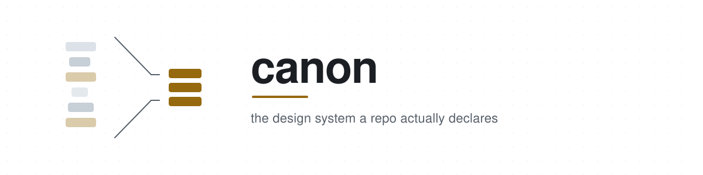
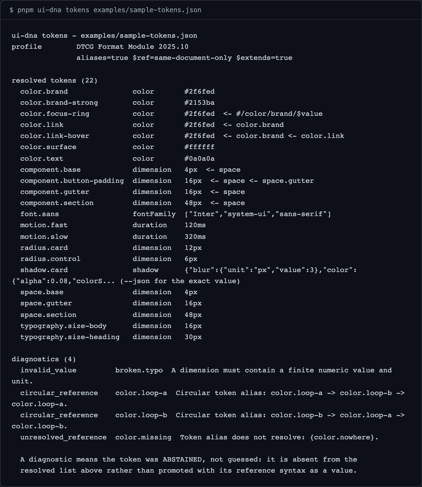

<div align="center">

<picture>
  <source media="(prefers-color-scheme: dark)" srcset="docs/assets/banner-dark.svg">
  
</picture>

<p>the design system a repo actually declares</p>

<p>
  <a href="https://www.npmjs.com/package/@apatureai/canon"></a>
  <a href="https://github.com/apatureai/canon/actions/workflows/ci.yml"></a>
  <a href="LICENSE"></a>
</p>

<p>Part of the <a href="https://github.com/apatureai">Apature stack</a> — automated design review for rendered UI. The <a href="https://github.com/apatureai/.github/blob/main/profile/README.md">org profile</a> maps how the pieces compose.</p>

</div>



canon reports the design tokens a repository *declares* — and when a project declares none, it prints `resolved tokens (0)` and names every file it read, rather than invent a design system the team never agreed to. It is a strict DTCG 2025.10 token resolver plus a scanner that reads CSS custom properties, Tailwind v3/v4, and DTCG token files out of a project's own source. It never runs a browser, never calls a model, never edits your code, and needs no credentials or network access: it reads and it reports.

> Renamed from `ui-dna` to `canon`. The npm packages live under the `@apatureai/*` scope; the CLI binary is still `ui-dna`.

## Quickstart

Node `>=24` and pnpm 9.15.0 (`corepack enable pnpm`). No credentials, no network, no browser. Two commands, about a minute, run from the repository root.

```bash
git clone https://github.com/apatureai/canon.git
cd canon
pnpm install --frozen-lockfile
pnpm build          # tsc -b; the CLI runs from packages/cli/dist, so this is not optional
```

Resolve a DTCG token file — the four broken tokens are **abstained** (listed under diagnostics, absent from the resolved set), never guessed:

```console
$ node packages/cli/dist/bin.js tokens examples/sample-tokens.json
ui-dna tokens - examples/sample-tokens.json
...
resolved tokens (22)
  color.brand               color       #2f6fed
  color.focus-ring          color       #2f6fed  <- #/color/brand/$value
  ...
diagnostics (4)
  invalid_value         broken.typo  A dimension must contain a finite numeric value and unit.
  circular_reference    color.loop-a  Circular token alias: color.loop-a -> color.loop-b -> color.loop-a.
  unresolved_reference  color.missing  Token alias does not resolve: {color.nowhere}.
```

Scan a project directory and write a content-addressed snapshot:

```console
$ node packages/cli/dist/bin.js context examples/sample-project --out out/genome.json
...
resolved tokens (16)
...
conflicts (2)
  tokens.color.--color-brand  resolved "#2f6fed" (code, confidence 0.49)
      "#0a58ca"  code 0.60  src/styles.css
      "#2f6fed"  code 0.70  src/theme.css
...
context block
  contentHash     sha256:da5aa778e56a08caea731d4c69672400c78be88d8008aac5267086ab2b2b0a17
wrote draft genome  out/genome.json
```

Run it twice and the `sha256:` hash is byte-identical. The full annotated transcripts — including the optional `--exec-tailwind-config` run that jumps 16 tokens to 364 — are in [docs/demo-walkthrough.md](docs/demo-walkthrough.md).

`@apatureai/canon` is also on npm and carries the `ui-dna` bin, so `npm i -g @apatureai/canon` puts the command on your `PATH` without a checkout.

## What you get

`tokens` resolves one DTCG document. `resolved tokens (22)` lists every value with its type and, where it is an alias, the chain it followed (`color.link  #2f6fed  <- color.brand`). `diagnostics (4)` lists what it refused: `broken.typo` (a malformed dimension), `color.loop-a`/`color.loop-b` (a circular alias), and `color.missing` (an unresolvable reference). Each refused token is **absent** from the resolved list, never promoted with its reference syntax as a value. A resolver that reported 26 tokens would have guessed. Add `--json` for exact, unelided values; `--strict` exits 2 when any diagnostic was raised.

`context` walks a project and reconciles every static design source it finds. Against `examples/sample-project` it reads six files, resolves 16 tokens, and reports two `conflicts` where `src/styles.css` and `src/theme.css` declare the same custom property with different values. The winning value keeps provenance precedence, but its confidence is *degraded* by the disagreement — `--color-brand` resolves to `#2f6fed` at confidence `0.49`, below either source that declared it — and both losing candidates stay in the report. `--out` writes a schema-valid draft `DnaSnapshot`; every field carries `{ value, confidence, provenance }`. The `contentHash` is content-addressed: identical sources produce identical bytes on every machine.

The zero case is the design. Point `context` at a project styled entirely in utility classes and it prints `resolved tokens (0)`, then names every file it opened and why each contributed nothing — because mining a scale out of `p-4 rounded-lg` would mean inventing a design system the team never agreed to. [Point it at your own repository](#3-point-it-at-your-own-repository) states that rule in full.

To see the shape of the snapshot, read one field back out — `--color-brand` resolves at confidence `0.49`, *below* either source that declared it, because two files disagreed:

```console
$ node -e "const g=require('./out/genome.json'); console.log(g.tokens.color['--color-brand'])"
{
  value: '#2f6fed',
  confidence: 0.48999999999999994,
  provenance: 'code'
}
```

## Usage

Four subcommands. Full flag reference and the runnable library example are in [docs/api.md](docs/api.md).

- **`ui-dna tokens <file.json>`** — resolve one DTCG token document. `--json`, `--strict`.
- **`ui-dna context <directory>`** — walk a project, extract every static design source, reconcile, and build a context block. `--json`, `--out <file>`, `--repo <owner/name>`, `--exec-tailwind-config`, `--max-depth <n>`, `--max-files <n>`, `--strict`.
- **`ui-dna approve <genome.json>`** — run the draft → in_review → approved transition and stamp the content-addressed immutable `dnaVersion`. Nothing downstream reads a draft. `--out <file>`.
- **`ui-dna export <genome.json> --target <verdict|lattice|pointer>`** — project an approved genome into one downstream consumer's read contract. `--out <file>`.

Exit codes: `0` success, `1` usage or IO failure, `2` `--strict` and the report was not clean. A **truncated walk** (a `--max-files`/`--max-depth` bound was hit) and a **refused source** (a candidate file that could not be parsed) are both treated as "not clean": every count becomes a lower bound, the report says so, and `--strict` exits 2. [docs/api.md](docs/api.md) has the exact banners, the "which files are read" rules, and the reasoning.

### 3. Point it at your own repository

`ui-dna` reads **declared** design tokens. It does not infer a design system from usage: it will not mine `p-4 rounded-lg text-slate-900` out of your JSX and call it a spacing scale. You get tokens from a `:root` / `html` / `.dark` / `[data-theme]` custom-property block, a literal Tailwind v4 `@theme { ... }` block, a DTCG or Style Dictionary token file, or a Tailwind v3 config **with `--exec-tailwind-config`**. Importing Tailwind v4 as `@import "tailwindcss"` declares nothing in your repository, and `package.json` only contributes component conventions for shadcn/ui, Radix, MUI, Chakra and Mantine.

So a plain Vite/React app that styles entirely in utility classes legitimately reports `resolved tokens (0)`. `examples/utility-only-project` is exactly that project, and its report explains its own zero — every candidate file the walk opened is listed with the reason it contributed nothing — so nobody has to find this section to interpret one. The full run is in [docs/demo-walkthrough.md](docs/demo-walkthrough.md#3-point-it-at-your-own-repository); inferring tokens from usage is a genuinely different problem and a design proposal before code ([roadmap item 8](docs/roadmap.md)).

### The confidence ladder

Every extracted fact is a `Fact<T>`: `{ value, confidence, provenance }`. The defaults, in descending order:

| Source | Provenance | Confidence |
|---|---|---|
| Human sign-off during review | `human` | 1.0 (reserved) |
| `.designreview.yml` brand block | `human` | 0.9 |
| `tokens.json` / Tailwind config | `config` | 0.8 |
| Tailwind v4 `@theme` block | `code` | 0.7 |
| Raw CSS custom properties | `code` | 0.6 |
| Component library present in `package.json` | `code` | 0.5 |

Conflicts are promoted into advisory `DriftHint`s (`config says X but pixels show Y`, or a *dead token* the codebase declares that nothing rendered ever uses). Drift never mutates the resolved output and never canonizes the drifting value.

## Design notes

The long-form writing moved out of this README, verbatim, into `docs/`. Each answers one question:

- [docs/design-notes.md](docs/design-notes.md) — who this is for, and why abstention, disagreement-aware confidence, determinism and the DTCG corpus benchmark are the interesting parts.
- [docs/how-it-works.md](docs/how-it-works.md) — the seven packages, how a fact flows from source to approved snapshot, and the two design decisions (revocable approval, a PR-fair drift gate) worth reading the code for.
- [docs/dtcg-profile.md](docs/dtcg-profile.md) — exactly which slice of DTCG Format Module 2025.10 `resolveTokensJson` implements, and which Resolver Module features are refused and why.
- [docs/api.md](docs/api.md) — the full CLI flag reference and the runnable `examples/library-example.ts` walk-through.
- [docs/demo-walkthrough.md](docs/demo-walkthrough.md) — the complete quickstart transcripts with annotations.

## Status

Verified on 2026-08-24 (Node 24.14.0, pnpm 10.34.3): lint clean, typecheck clean, **519 tests across 60 files passing** in about 5 seconds, all offline. The DTCG resolver, static extraction, reconciliation, content hashing, the sign-off state machine, the drift gate, and the `verdict`/`lattice`/`pointer` projections all work today; the six public `@apatureai/*` packages are published to npm. Rendered-evidence capture, persistent storage, and a sign-off UI are not implemented.

One reproducible datapoint about the profile's strictness: `pnpm eval:dtcg-corpus` resolves 20 public token files pinned by blob SHA, and last ran to **384 strict-profile tokens out of 1,629 token-shaped nodes, with 1,223 diagnostics** — roughly a quarter of what is published satisfies 2025.10 without complaint. Full status table and the ten-item roadmap: [docs/roadmap.md](docs/roadmap.md).

## Roadmap

The gaps, each named precisely enough to pick up, live in [docs/roadmap.md](docs/roadmap.md) — a capture adapter, a persistent `SnapshotStore`, a `ui-dna review` sign-off surface, a served read contract, DTCG Resolver Module support, more extractors, and [inferring tokens from usage](docs/roadmap.md).

## Related repositories

Nothing here imports any of these; the coupling is by data contract only, and the `SnapshotResponse` wire shape is pinned by a golden fixture (`packages/store/test/fixtures/golden-snapshot-response.json`) so a byte-compat test fails if the contract moves underneath a consumer.

- [verdict](https://github.com/apatureai/verdict): capture, grounded critique, eval and feedback substrate. It produces the artifacts that arrive here as `CaptureEvidence` and consumes approved snapshot slices.
- [gate](https://github.com/apatureai/gate): a GitHub PR review surface.
- [bastion](https://github.com/apatureai/bastion): the same review, in-loop over MCP.
- [lattice](https://github.com/apatureai/lattice): a token-efficient scene graph.
- [sigil](https://github.com/apatureai/sigil): a fixture-driven model quality and efficiency audit harness.

## Contributing

See [CONTRIBUTING.md](CONTRIBUTING.md) for conventions, layout, and how pull requests are reviewed; [docs/development.md](docs/development.md) covers the test/lint commands, the DTCG corpus benchmark, and regenerating the hero image.

## Security

No credentials, network calls or telemetry exist in the library or CLI code, and the one network-touching script is opt-in. Do not point `--exec-tailwind-config` at a repository you do not trust. To report a vulnerability, see [SECURITY.md](SECURITY.md).

## License

MIT — see [LICENSE](LICENSE).
